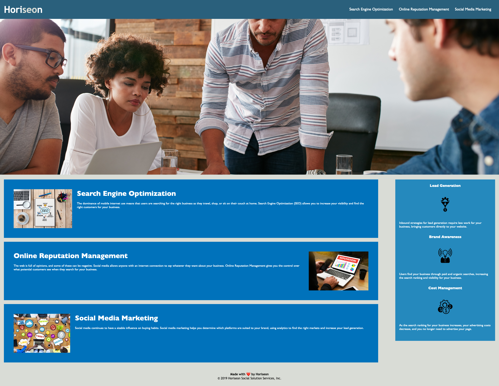

# Refractored Horiseon Site

## Description

### In this project, the existing code for a Marketing wesbite has been significantly editted in the following ways:
Some div elements were replaced with semantic HTML elements

This allowed for CSS code to be made more concise

Comments were added to the CSS code

Many unecessary classes were removed from the HTML code 

Alt attributes were added to all images and logos

Some more minor fixes done to the HTML code

### The added benefits/features from these changes are:
HTML code easier to parse through

CSS code easier to parse through

Accessibility improved for visitors to the website

Website is more functional

### Website link:

## Installation

Download an internet browser application
Visit the link in the description

## Usage 

Here is what the website should look like

## Credits

No collaborators

## License

MIT License

Copyright (c) [2023] [sssou]

Permission is hereby granted, free of charge, to any person obtaining a copy
of this software and associated documentation files (the "Software"), to deal
in the Software without restriction, including without limitation the rights
to use, copy, modify, merge, publish, distribute, sublicense, and/or sell
copies of the Software, and to permit persons to whom the Software is
furnished to do so, subject to the following conditions:

The above copyright notice and this permission notice shall be included in all
copies or substantial portions of the Software.

THE SOFTWARE IS PROVIDED "AS IS", WITHOUT WARRANTY OF ANY KIND, EXPRESS OR
IMPLIED, INCLUDING BUT NOT LIMITED TO THE WARRANTIES OF MERCHANTABILITY,
FITNESS FOR A PARTICULAR PURPOSE AND NONINFRINGEMENT. IN NO EVENT SHALL THE
AUTHORS OR COPYRIGHT HOLDERS BE LIABLE FOR ANY CLAIM, DAMAGES OR OTHER
LIABILITY, WHETHER IN AN ACTION OF CONTRACT, TORT OR OTHERWISE, ARISING FROM,
OUT OF OR IN CONNECTION WITH THE SOFTWARE OR THE USE OR OTHER DEALINGS IN THE
SOFTWARE.

